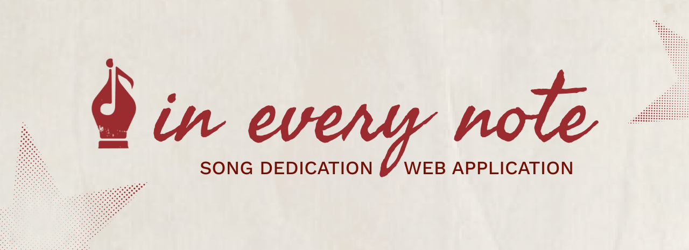

# Tomorrow’s Web | Song Dedication Web App

Have you ever listened to a song and thought, *“This reminds me of them”?*

***In Every Note*** is a web application where users can dedicate a song and a message to someone they care about, whether it’s a friend, family member, partner, or a loved one because sometimes, music helps us express more than words can.

---

### **Submitted by:**
**Name:** Princess Jasmin S. Panilagao  
**Registration Number:** 481457  
**Course & Module:** Creative Computing Year 3 L6, Tomorrow’s Web

---

## 💌 **Features**  
- Create and share personalized song notes with custom messages
- Upload cover images and audio files (MP3, WAV, M4A, OGG) for each note
- Generate unique shareable links for every dedication
- Listen with a built-in audio player that supports seamless playback
- Explore public notes shared by other users across the platform
- Responsive design for all screens (laptop, tablet, mobile)

---

## 🛠 **Technology Stack**
- **Frontend**: React (Vite)
- **Styling**: Tailwind CSS
- **State Management**: Redux
- **HTTP Requests**: Axios
- **Backend**: Node.js + Express
- **Database**: MongoDB (Mongoose)
- **Deployment**:  Render

---

## 🎶 **Web App (Walkthrough & Live URL)** 
**★ Live URL**: [https://ineverynote.onrender.com](https://ineverynote.onrender.com)

**★ Walkthrough Video**: [Watch on YouTube](https://youtu.be/8iTT-WxYumU)
